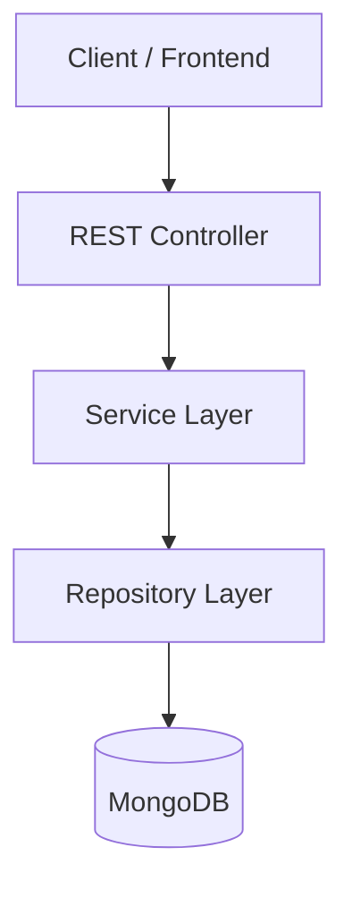
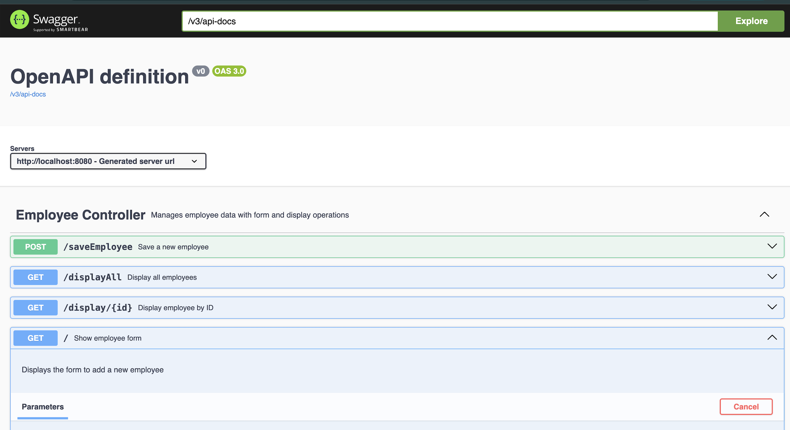
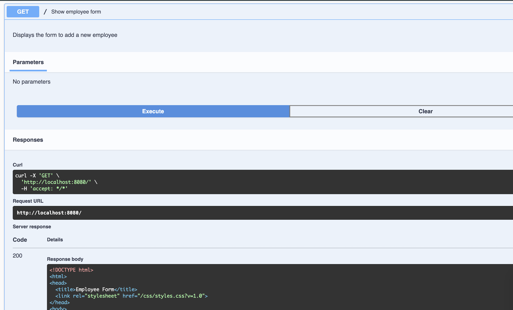
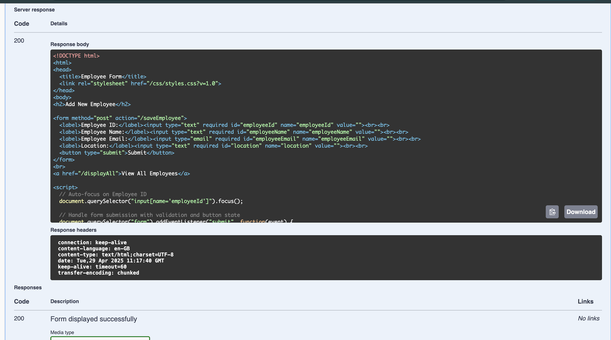

# 🚀 Employee Management API


A **Employee Management API** built using **Spring Boot**, **Spring Data MongoDB**, and **Swagger/OpenAPI**, designed for managing employee data efficiently and cleanly.  
This API is built with a modern layered architecture, includes end‑to‑end CRUD operations, strong validation, exception handling, and embedded documentation.

---

# 📌 Table of Contents
1. [Overview](#overview)
2. [Features](#features)
3. [Architecture](#architecture)
4. [Tech Stack](#tech-stack)
5. [Project Structure](#project-structure)
6. [API Documentation](#api-documentation)
7. [Endpoints](#endpoints)
8. [JSON Examples](#json-examples)
9. [Running the Application](#running-the-application)
10. [Screenshots](#screenshots)
11. [License](#license)

---

# 📖 Overview
The **Employee Management API** allows clients to:

- Create new employee records  
- Retrieve all employees  
- Retrieve employees by ID  
- Update existing employee records  
- Delete employees  
- Explore full API documentation via **Swagger UI**

All data is stored in **MongoDB**, and the application follows a clean multi‑layer architecture.

---

# 🌟 Features
✔ Full CRUD operations  
✔ RESTful architecture  
✔ MongoDB integration  
✔ Global exception handling  
✔ Swagger/OpenAPI documentation  
✔ Unit tests (JUnit)  
✔ CI Workflows (CodeQL, Dependency Review)  
✔ Clean project structure  
✔ Fast and lightweight  

---

# 🏛 Architecture



---

# 🧰 Tech Stack

| Layer | Technology |
|-------|------------|
| Language | Java 17 |
| Framework | Spring Boot |
| Database | MongoDB |
| Build Tool | Maven |
| Documentation | Swagger / Springdoc OpenAPI |
| Testing | JUnit |

---

# 📂 Project Structure

```
employee-management-api/
 ├── src/
 │   ├── main/
 │   │   ├── java/com/example/employee_management_api/
 │   │   │   ├── controller/
 │   │   │   ├── service/
 │   │   │   ├── repository/
 │   │   │   ├── exception/
 │   │   │   └── model/
 │   │   └── resources/
 │   │       ├── application.properties
 │   │       ├── templates/
 │   │       └── static/
 │   └── test/
 ├── screenshots/
 ├── pom.xml
 └── README.md
```

---

# 📘 API Documentation

Once the application is running, access:

👉 **Swagger UI**  
```
http://localhost:8080/swagger-ui.html
```

👉 **OpenAPI JSON**  
```
http://localhost:8080/v3/api-docs
```

---

# 🔥 Endpoints

| Method | Endpoint | Description |
|--------|----------|-------------|
| **GET** | `/api/employees` | Get all employees |
| **GET** | `/api/employees/{id}` | Get employee by ID |
| **POST** | `/api/employees` | Create a new employee |
| **PUT** | `/api/employees/{id}` | Update employee |
| **DELETE** | `/api/employees/{id}` | Delete employee |

---

# 🧩 JSON Examples

### ➕ Create Employee
```json
{
  "employeeId": "E1001",
  "name": "Alice Johnson",
  "email": "alice@example.com",
  "location": "New York"
}
```

### 🔄 Update Employee
```json
{
  "name": "Alice J.",
  "location": "San Francisco"
}
```

### 📤 Response Example
```json
{
  "id": "67a123bcde9482",
  "employeeId": "E1001",
  "name": "Alice Johnson",
  "email": "alice@example.com",
  "location": "New York"
}
```

---

# ▶️ Running the Application

### **Clone Repository**
```bash
git clone https://github.com/TheComputationalCore/employee-management-api.git
cd employee-management-api
```

### **Configure MongoDB**
Make sure MongoDB is running locally:

```
mongodb://localhost:27017
```

### **Build & Run**
```bash
mvn clean install
mvn spring-boot:run
```

---

# 📸 Screenshots

### Swagger UI  


### API Flow  


### Example Output  


---

# 📄 License
This project is licensed under the **MIT License**

---


